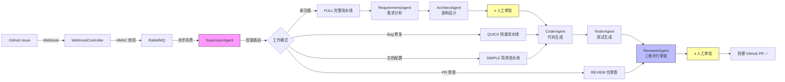

# DevFlow Agent

> 🚀 **AI 多智能体全流程开发助手** — 从 GitHub Issue 到 Pull Request，6 个 AI Agent 自动完成需求分析、架构设计、代码生成、测试编写、多维度审查。

<p align="center">
  
  
  
  
  
  
  
</p>

---

## 🎯 一分钟看懂这个项目

**一句话**：收到 GitHub Issue → **AI 自动分析需求 → 设计架构 → 生成代码 → 编写测试 → 多维度审查 → 创建 PR**。

**适合谁看**：
- 🧑‍💻 面试官 / HR：这是一个展示后端工程化能力的**个人求职作品集**
- 👨‍🎓 学习者：展示了 Java 生态下 LLM 应用落地的完整思路
- 🛠 开发者：可以直接 Docker 一键部署体验

**为什么做这个**：学习多智能体协作思路，探索 LLM 工程化接入（限流、熔断、异步、缓存、容器化）在真实项目中的落地。

---

## 🏗 架构概览



### 6 个 AI Agent 职责

| Agent | 角色 | 做什么 |
|-------|------|--------|
| **SupervisorAgent** | 🧭 监督者 | 分析 Issue 类型，智能路由到 4 种工作模式之一 |
| **RequirementsAgent** | 📋 需求分析师 | 提取功能需求、验收标准、边界条件 |
| **ArchitectAgent** | 🏛 架构设计师 | 最小改动方案、类结构、接口定义 |
| **CoderAgent** | 💻 程序员 | 生成完整 Spring Boot + MyBatis-Plus 代码 |
| **TesterAgent** | 🧪 测试工程师 | 生成 JUnit5 + Mockito 单元测试 |
| **ReviewerAgent** | 🔍 代码审查员 | 安全/性能/规范三维**并行**审查，0-100 评分 |

---

## 🚀 5 分钟快速启动

### 前提条件

- Docker 24+ + Java 17+ + Maven 3.8+
- DeepSeek API Key（[免费注册](https://platform.deepseek.com/) 送 500 万 token）

### 三步跑起来

```bash
# 1. 克隆项目
git clone https://github.com/wjc-jfbm/devflow-agent.git
cd devflow-agent

# 2. 配置环境变量（只需填 API Key）
cp .env.example .env
# 编辑 .env，把 OPENAI_API_KEY=sk-xxxxx 改成你的真实 Key

# 3. 一键启动
docker compose up -d
# 等待 1-2 分钟，访问 http://localhost:8080/doc.html
# 账号: admin  密码: devflow2024
```

### 创建第一个 AI 任务

打开 Swagger → 右上角 **Authorize** 登录：

```
POST /api/projects  →  创建项目（填 GitHub 仓库信息）
POST /api/tasks     →  创建任务，自动触发 AI 流水线
GET  /api/tasks/{id}/progress  →  看 AI 处理进度
POST /api/tasks/{id}/approve  →  审批通过后继续执行
```

> 💡 配置 GitHub Webhook 后，**新 Issue 自动触发**全流程。详见 [docs/DEPLOY.md](docs/DEPLOY.md)

---

## 💡 技术亮点（面试重点）

### 1. 多智能体协作编排
- 6 个 Agent 流水线编排，4 种工作模式按需跳过阶段
- LLM 路由决策 + 代码层白名单兜底（LLM 出错默认 fallback 到 FULL）
- 各阶段输出 Redis 缓存，支持断点恢复

### 2. 异步任务与可靠性
- **RabbitMQ 异步消费**：Webhook 100ms 响应 → MQ 异步触发 AI 流水线
- **Redis 分布式锁**（SETNX + Lua 脚本释放）：多实例防重复处理
- **Resilience4j 双重保护**：RateLimiter（50 RPM）+ CircuitBreaker（50% 故障率熔断）
- **指数退避重试**：Agent 调用失败自动重试，`2^attempt * 1s` 间隔

### 3. 并发性能优化
- **三维度并行审查**：线程池（core 10, max 20）+ `Future.get(120s)` 超时兜底
- **日志异步写入**：AgentExecution 状态更新剥离到单线程池，减少主流程 DB 阻塞
- **对象复用**：`ThreadLocal<Mac>` 避免 HMAC 签名验证的同步锁竞争

### 4. 数据库与存储
- `GROUP BY` 聚合替代多次 `COUNT(*)`，减少数据库往返
- SQL 聚合函数（SUM/AVG）替代全表拉取 + 内存流式计算
- HikariCP 连接池（20 连接）+ 小事务策略（LLM 调用在事务外执行）

### 5. 部署与运维
- **Docker Compose** 一键编排 6 个服务（MySQL + Redis + RabbitMQ + pgvector + App + Nginx）
- **Nginx** 反向代理 + TLS + 限流（API 100r/s, Webhook 200r/s）
- **多环境隔离**：dev / docker / prod 三套 profile，敏感信息环境变量注入
- **安全**：Webhook HMAC-SHA256 签名校验 + 恒定时间比较防时序攻击 + Spring Security HTTP Basic

---

## 📁 项目结构

```
devflow-agent/
├── devflow-agent-api/        # REST API 层（Controller、DTO、Security、Swagger）
├── devflow-agent-core/       # 核心引擎（6 个 Agent、WorkflowEngine）
├── devflow-agent-common/     # 公共层（枚举、模型、异常、工具类）
├── devflow-agent-infra/      # 基础设施（MyBatis、Redis、RabbitMQ、LangChain4j）
├── sql/init.sql              # 数据库建表脚本
├── nginx/
│   ├── nginx.conf            # 反向代理 + TLS + 限流配置
│   └── ssl/                  # SSL 证书目录
├── docker-compose.yml        # Docker Compose 一键部署
├── Dockerfile                # 应用容器镜像
├── deploy.sh                 # 生产环境一键部署脚本
├── Makefile                  # 开发常用命令
└── .env.example              # 环境变量模板
```

---

## 🛠 技术栈

| 层级 | 技术 | 说明 |
|------|------|------|
| 框架 | Spring Boot 3.2 + Java 17 | 后端核心 |
| AI | LangChain4j + DeepSeek | LLM 接入（兼容 OpenAI） |
| 数据库 | MySQL 8.0 + MyBatis-Plus 3.5.5 | 业务数据持久化 |
| 缓存 | Redis 7 + Lettuce | 分布式锁 + 阶段结果缓存 |
| 消息队列 | RabbitMQ 3 | 异步任务解耦 |
| 限流熔断 | Resilience4j 2.2.0 | AI API 保护 |
| 反向代理 | Nginx 1.25 | TLS + 限流 + 反向代理 |
| 向量存储 | pgvector 0.8.0 | RAG 知识库（预留） |
| 部署 | Docker Compose | 一键启动全部服务 |
| 文档 | Knife4j / Swagger | API 在线文档 |

---

## 📊 任务统计看板

部署后访问 `GET /api/dashboard/stats` 可获取：
- 任务总数 / 完成数 / 运行数 / 失败数
- AI Token 消耗总量
- Agent 平均执行耗时

---

## 🔧 本地开发

```bash
# 只启动基础设施（IDE 中调试用）
docker compose up -d mysql redis rabbitmq pgvector

# IDE 运行 DevFlowApiApplication
# 或命令行：
mvn spring-boot:run -pl devflow-agent-api

# 访问文档：http://localhost:8080/doc.html
# 登录：admin / devflow2024
```

完整部署指南（含生产环境配置、GitHub Webhook 接入、HTTPS 证书）→ [docs/DEPLOY.md](docs/DEPLOY.md)

---

## 📝 后续计划

- [ ] Agent 执行链路全链路追踪（类似 LangSmith）
- [ ] 多租户/多项目隔离
- [ ] 任务优先级队列
- [ ] RAG 知识库接入项目代码规范
- [ ] WebSocket 实时推送流水线进度

---

## ⚠️ 说明

本项目为**个人开源学习项目**，用于探索 Java 生态下 LLM 多智能体落地方案。适合：
- 学习大模型 API 工程化接入思路
- 理解异步任务调度与后端稳定性设计
- 作为 Spring Boot + 中间件的综合实践参考

---

## 📄 License

MIT © [wjc-jfbm](https://github.com/wjc-jfbm)
